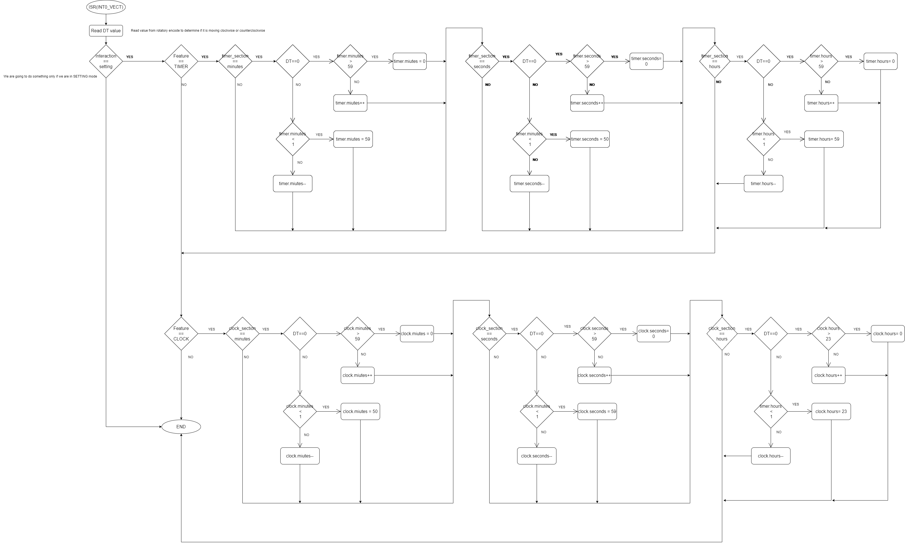

# Flowcharts   

To implement the different functionalities, we chose to rely exclusively on Interruption Subroutines (There is no code in the while(1) loop). Here are the flowcharts for all the interruption subroutines, with a brief explanation of what they do for each one.

### ISR(TIMER1_OVF_vect)
This subroutine is executed every 262ms. First, it triggers the ADC conversion. Then, when we are in setting mode (we want to set a value) this subroutine is in charge of making the value that is being set blink (that is, either erase it or print it).

### ISR(TIMER2_OVF_vect)
It is used for setting the time values of the different features/modes (Timer, Clock or Stopwatch). The overflow occurs every 100ms.

### ISR(ADC_vect)
Based on the ADC values that are read from the joystick we define the direction that the joystick is pointing so we can later move arround the modes (clock, stopwatch and timer). If a direction is detected, we trigger a software interrupt (PCINT0)

### ISR(PCINT0_vect)
This subroutine is triggered when a direction is detected.
- If we are in mode of interraction 'SELECTION' : It computes the next mode based on the joystick direction and the actual mode, and prints the selector (*) in front of the mode.
- If we are in mode of interraction 'SETTING' : It computes the section of the mode we are trying to set (either HOURS, MINUTES,  or SECONDS), based on the actual section of the mode selected and the joystick direction. We can't set the STOPWATCH though (because it's just a stopwatch).

### ISR(INT0_vect) / ISR(TIMER0_vect)
Subroutine triggered by the clock signal of rotatory encoder, it is used to change the value of a the parameter being set. For example, if we selected the mode 'CLOCK' and then selected the hours, moving the rotary encoder clockwise will increase the hours value.

Actually, on the last lab, we figured out that triggering an interrupt with the clock signal sometimes made the value "jump" instead of incrementing step by step. This is because the clock does some pulses before stabilizing. We fixed it by triggering the routine with a timer interrupt, each 4 millisecond, and checking the previous value of the clock to detect rising / falling edges. (See last commits)

### ISR(INT1_vect)
This subroutine is triggered by a push on the joystick switch. It allows the program to switch between the mode of interaction 'SELECTION' (moving around the 3 features) and the mode of interaction 'SETTING' (changing the values).

### ISR(PCINT2_vect)
This subroutine is triggered when we push or release the rotary encoder button, but we check the level to execute the usefull code only when the button is pushed (and not released). (It would have been better to create an interrupt on falling edge only, but INT0 and INT1 are already used). If we are in mode of interaction 'SELECTION', the push can start and stop the TIMER or the STOPWATCH, when they are selected. If we are in mode of interaction 'SETTING', the push will reset all the values of the mode selected.

