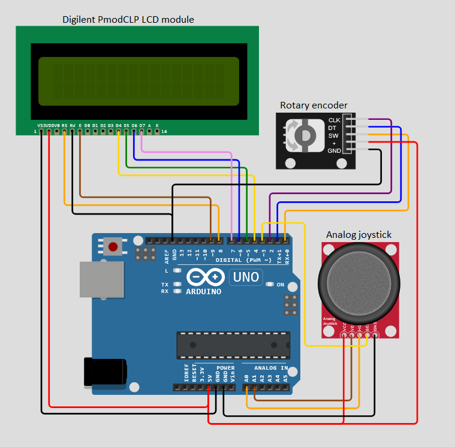

# Digital Electronics 2 - Project

## Description of the project

Application using an analog joy-stick (2 ADC channels, 1 push button), rotary encoder (+ push button), and Digilent PmodCLP LCD module.
We chose to implement three different features for this project : A timer, a clock and a stopwatch. The joystick will allow the user to choose between the 3 modes, and a click on the joystick push button will allow to setup the mode selected. Then, the joystick is used to select hours/minutes/seconds, and the rotary encoder is used to choose the value. A click on the rotary push button allows to reset all the values. Then, another click on the joystick push button exits the setting mode and goes back to selection. When selected, the timer and stopwatch are launched with a click on the rotary encoder push button.

## Team members

* Thibault Sourdin
* Nicolás González Mazuelos

## Hardware description

- The screen Digilent PmodCLP has the same interface as the Hitachi HD44780 chipset, used in the lab. Therefore, it could be connected as we did during the labs :
  - VSS : Ground
  - VDD : 5V
  - RS : PB0
  - Enalble : PB1
  - RW : Ground (always write)
  - D7:4 : PD7:4

  The definitions of pins defined in lcd_definitions.h can also be reused.

- The joystick has 2 variable tension outputs : one for the horizontal direction (x-axis) and one for the vertical direction (y-axis). They are connected to ADC Channels 0 and 1 on the micro controller (which corresponds to PC0 and PC1) The push button is used to trigger an external interrupt and is therefore connected to the external interrupt INT1 (on pin PD3).

- The rotary encoder has 2 digital outputs : CLK and DT. CLK is connected to pin PD2. DT is connected to a simple GPIO (PD1). The push button is connected to PD0 and triggers the interrupt PCINT2 on pin change.

The following schematic shows the final electronic assembly:

## Software description
For this projects the next libraries were used:
* [LCD](./lib/lcd): library used for all the operations (read,write, interface settings, etc).
* [UART](./lib/uart): used for debugging.

* [GPIO](./lib/gpio): used for the Atmega328p input/output pins management.
* [Timer](./include/timer.h): used for preprocessor directives related to timers 0, 1 and 2. 
* [Adc](./include/adc.h): used for preprocessor directives related to the analog to digital internal conversor of the Atmega328p.

All the Interrupt Service Routines with their flowcharts are [here](./Documentation)

## Video

You can find the practical demonstration [here](https://www.youtube.com/watch?v=-vp1Gv8bRH0&ab_channel=NicoGM).
The push button of the joystick doesn't work each time we press it. We figured out that it was because the rising edge is not "clear" and does some quick pulses before stabilising to a high or low level. As it triggers an interruption subroutine which switches between 2 modes, if the number of edges before stabilizing is even, the mode will stay the same ; and if it is odd, the switching will work fine.
It would have been better to check the level on the pin at regular intervals, like a few milliseconds, rather than triggering an interruption. Actually, we had the same problem for the clock of the rotary encoder, and fixed it, but we didn't have enough time to fix the button.

## References

1. [Manual for ATmega microcontrollers](https://www.microchip.com/en-us/product/ATmega328p)
2. Previous labs
